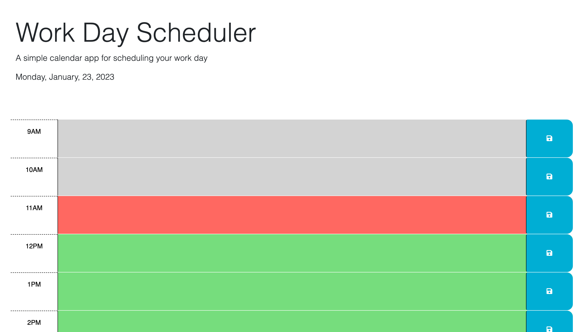
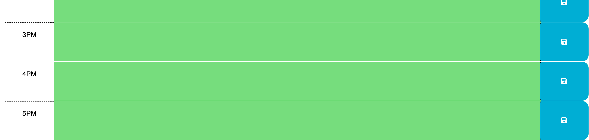

# <Work Day Scheduler>

## Description

This application is a simple work day scheduler. You can plan out your day by the hour. This will also display in a colour coded fashion, so the user can easily see what tasks are in the past, present and future. This application also displays the current date andday of the week.

### AS AN employer with access to sensitive data*
* AS AN employee with a busy schedule
* I WANT to add important events to a daily planner
* SO THAT I can manage my time effectively

## Problems Solve

This application provides a simple organisational tool for the user to help increase their productivity. 

* GIVEN I am using a daily planner to create a schedule
* WHEN I open the planner
* THEN the current day is displayed at the top of the calendar
* WHEN I scroll down
* THEN I am presented with time blocks for standard business hours
* WHEN I view the time blocks for that day
* THEN each time block is color-coded to indicate whether it is in the past, present, or future
* WHEN I click into a time block
* THEN I can enter an event
* WHEN I click the save button for that time block
* THEN the text for that event is saved in local storage
* WHEN I refresh the page
* THEN the saved events persist

## Usage

The following images show the completed website. You can visit the site by clicking [here.](https://tleeming15.github.io/work-scheduler/)

## Installation

N/A

## License

MIT